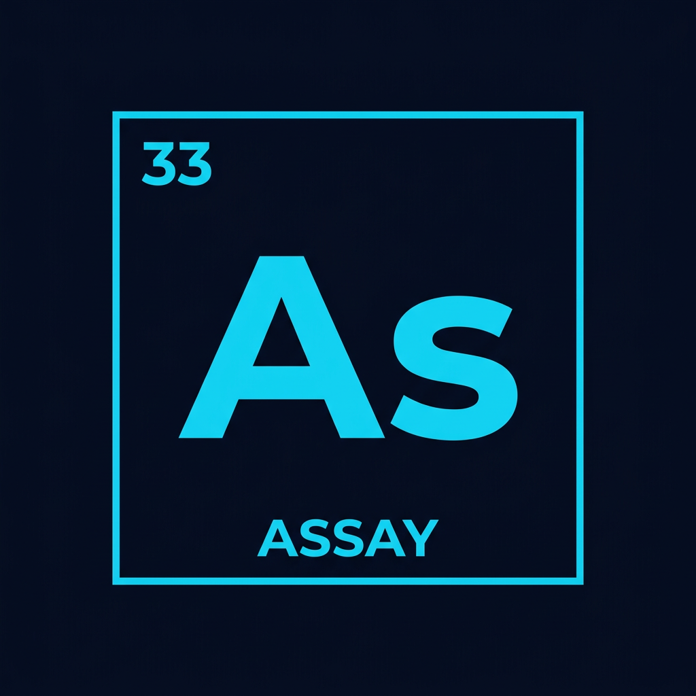

<p align="center">
  
</p>

<h1 align="center">Assay</h1>

<p align="center">
  <strong>Your COBOL codebase, finally understood.</strong><br/>
  COBOL documentation generator. 5-pass analysis pipeline.
</p>

<p align="center">
  <a href="https://assay.software">Website</a> ·
  <a href="https://assay.software/demo">Live Demo</a> ·
  <a href="https://assay.software/docs">Architecture Docs</a>
</p>

---

## How It Works

1. **Upload** COBOL source files (.cbl, .cob, .cpy)
2. **Parse** structural elements (divisions, sections, paragraphs, data items, COPY/CALL references)
3. **Analyze** through a 5-pass AI pipeline using Claude Opus 4.6 with 1M token context
4. **Download** a complete knowledge base as structured markdown

### 5-Pass Pipeline

| Pass | Output | Description |
|------|--------|-------------|
| 01 - Overview | 9-section markdown | Business purpose, processing logic, data structures, modernization notes |
| 02 - Business Rules | Severity-rated table | Every conditional extracted with business meaning |
| 03 - Dependencies | Mermaid graph diagram | CALL/COPY relationships with subgraph grouping |
| 04 - Dead Code | Confidence-rated table | Unreachable paragraphs, unused data items, dormant copybook fields |
| 05 - Data Flow | Sequence diagram | Data movement from input files through transformations to outputs |

## Stack

- **Framework:** Next.js 16, React 19, TypeScript 5 (strict)
- **AI Engine:** Anthropic Claude Opus 4.6 (1M token context, 5-pass analysis)
- **Styling:** Tailwind CSS v4
- **Email:** Resend (transactional PoC requests)
- **Testing:** Playwright (full E2E suite)
- **Hosting:** Vercel (edge middleware, serverless functions)

## Architecture

Full architecture documentation with interactive Mermaid diagrams, expandable views, and sidebar navigation:

**[assay.software/docs](https://assay.software/docs)**

Key modules:

```
src/
  app/
    page.tsx              Landing page (hero, features, pricing, trust)
    demo/page.tsx         Pre-computed demo (zero API cost, typewriter animation)
    api/
      upload/route.ts     Multipart COBOL file upload + parse + cost estimate
      process/route.ts    Async 5-pass AI pipeline trigger
      status/[id]/        Job progress polling (0-100%)
      download/[id]/      Knowledge base download (JSON bundle)
  lib/
    cobol/
      parser.ts           Regex-based COBOL structural parser
      grouper.ts          Program grouping with COPY/CALL resolution
      call-chain.ts       Dependency graph builder
    ai/
      prompts.ts          5 specialized AI prompts + system prompt
      client.ts           Anthropic SDK wrapper (retry, cost tracking)
      token-counter.ts    Pre-processing cost estimation
    output/
      markdown.ts         Knowledge base document assembler
      mermaid.ts          Programmatic Mermaid diagram generator
  types/
    cobol.ts              COBOL source model (12 types)
    job.ts                Processing lifecycle (4 types)
    documentation.ts      Output document model (8 types)
  middleware.ts           Security headers + rate limiting
```

## Getting Started

```bash
cp .env.example .env.local
# Fill in ANTHROPIC_API_KEY
npm install
npm run dev
```

## Security

- In-memory rate limiting (contact: 5/hr, process: 3/6hr)
- HSTS preload, X-Frame-Options DENY, nosniff, Permissions-Policy
- Job ID format validation (regex allowlist)
- File extension allowlist (.cbl, .cob, .cobol, .cpy, .copy, .jcl, .proc)
- Source code stripped from status API responses
- No source code logging

## License

Proprietary. Copyright 2026 Solaisoft
